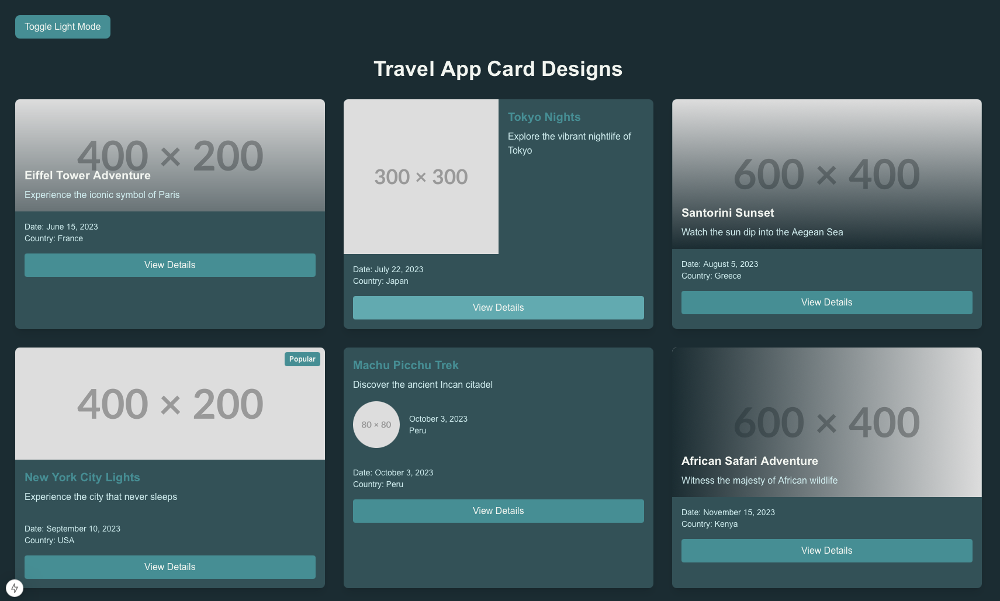

# Travel Card Showcase

A modern, responsive travel destination card showcase built with the AI of V0, Next.js and Tailwind CSS. Features multiple card layouts with a consistent design system and accessibility features.



## Features

- 🎨 10 unique card designs for travel destinations
- 🌓 Dark/Light mode toggle
- 📱 Fully responsive layouts
- ♿ Accessible design with ARIA labels
- 🎯 Consistent 4px design system
- 🎨 Blue Chill color scheme with WCAG compliant contrast ratios

## Technologies

- Next.js 15 (App Router)
- React 18
- Tailwind CSS
- TypeScript
- shadcn/ui components

## Color Scheme

The project uses the Blue Chill color palette:

- Primary: #438E95 (500)
- Light Background: #F2F5F0 (50)
- Dark Background: #1A2C32 (950)
- Accent: #5FAAB1 (400)
- Text Light: #325158 (800)
- Text Dark: #D0EEF0 (100)

## Getting Started

### Prerequisites

- Node.js 18.0 or higher
- npm or yarn

### Installation

1. Clone the repository:

   ```bash
   git clone https://github.com/yourusername/travel-card-showcase.git
   ```

2. Navigate to the project directory:

   ```bash
   cd travel-card-showcase
   ```

3. Install dependencies:

   ```bash
   npm install
   # or
   yarn install
   ```

4. Start the development server:

   ```bash
   npm run dev
   # or
   yarn dev
   ```

5. Open [http://localhost:3000](http://localhost:3000) in your browser

## Usage

The showcase includes various card layouts that you can use in your own projects:

- Standard card with image header
- Split layout cards
- Cards with gradient overlays
- Multi-image gallery cards
- Video preview cards
- Featured/Popular badges
- Romantic getaway tags

Each card is fully customizable through props and can be adapted to different use cases.

## Project Structure

```
travel-card-showcase/
├── app/
│   ├── layout.jsx
│   └── page.jsx
    └── globals.css
├── public/
```

## Contributing

Contributions are welcome! Please feel free to submit a Pull Request.

1. Fork the project
2. Create your feature branch (`git checkout -b feature/AmazingFeature`)
3. Commit your changes (`git commit -m 'Add some AmazingFeature'`)
4. Push to the branch (`git push origin feature/AmazingFeature`)
5. Open a Pull Request

## License

This project is licensed under the MIT License - see the [LICENSE.md](LICENSE.md) file for details.

## Acknowledgments

- Design inspiration from various travel websites
- Color palette generated using the Blue Chill scheme
- UI components from shadcn/ui library
